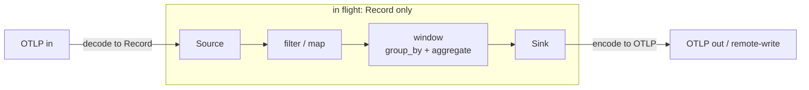
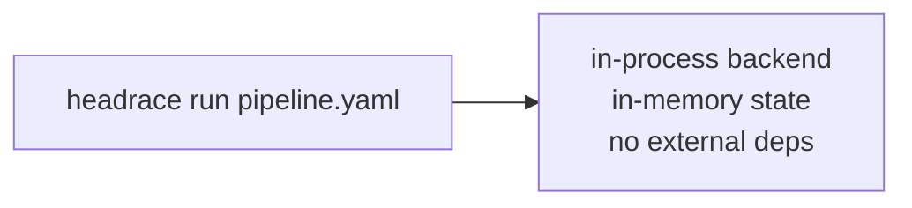
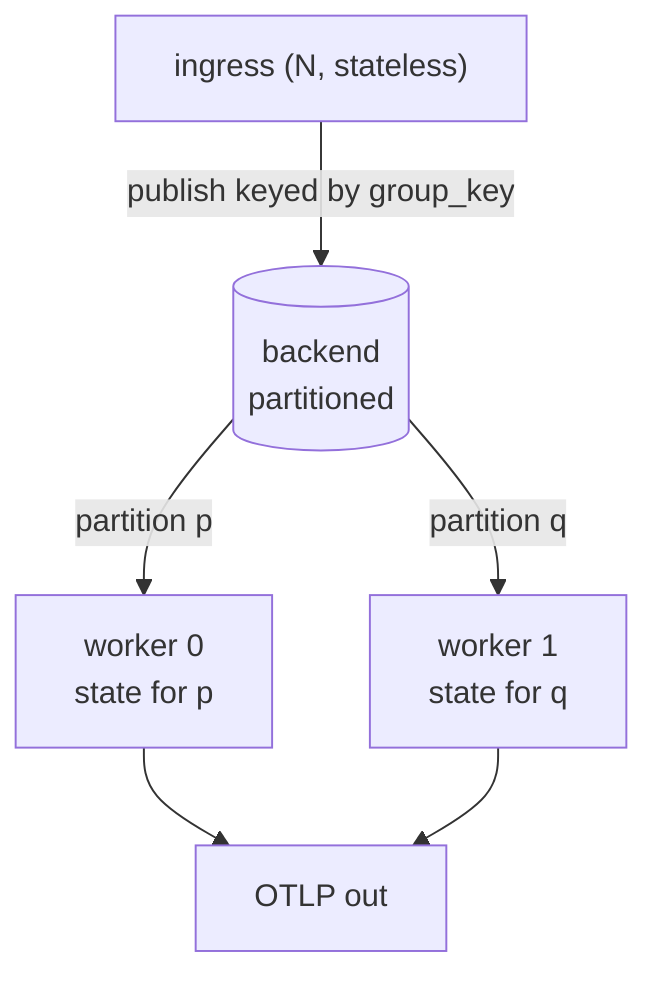
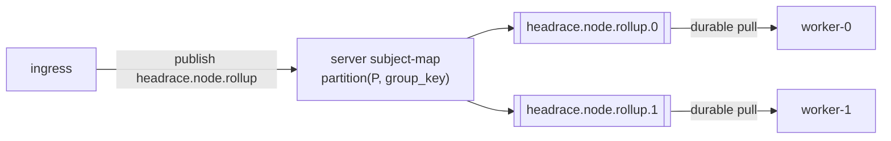

# Headrace - Design

OTel-native, stateful stream processing. Point telemetry at it, define aggregations
declaratively, emit to any OTLP-compatible backend. A single binary that runs in-process for dev
and edge, or scaled on Kubernetes over a partitioned backend.

**Principles**

- A layer, not infrastructure. Headrace has no broker, storage engine, or controller of its own.
  It runs on infrastructure you may already be running (NATS or Kafka, Kubernetes), because those
  tools are good at their jobs and we would rather not reinvent them.
- OTLP at the edges, a fixed transform catalog in the middle, WASM as the escape hatch.
- One binary; the deployment topology is chosen at startup.

## Dataflow

OTLP is decoded to an internal `Record` at ingest and encoded back at egress. Everything between
the edges operates on `Record`; transforms never see the wire format.



Two representations, kept separate:

- **Record** - the data in flight: the OTel data model, flattened to what transforms touch
  (`crates/headrace-core/src/record.rs`). The columnar path (OTel-Arrow / OTAP) is an internal
  optimization on this representation; users never handle it.
- **IR** - the program that processes records: Headrace's own transform-DAG spec (`headrace-ir`),
  OTel-aware but not OTLP. It is a config language, in the spirit of a Vector topology or a Flink
  job graph, and it is what an authoring agent targets in v0.2.

Stateless transforms (`filter`, `map`) hold nothing. State lives only in windowing transforms,
keyed by `group_by`, which is what makes horizontal scaling work.

## Run modes

The same binary takes a role at startup.

Monolithic, for dev and edge:



Scaled, on Kubernetes:



## Scaling and the backend

Stateful scaling means partitioning the keyspace so every record for a `group_key` reaches the
same worker, where its window state stays local. Headrace does not build that machinery:

- **Partition assignment and shuffle** -> the backend.
- **Pod lifecycle** -> Kubernetes (Deployment / StatefulSet).
- **Autoscaling** -> KEDA on backend lag.

**Who runs what.** You run the backend (NATS or Kafka) and Kubernetes, and give Headrace their
endpoints and credentials. Headrace provisions the topology it needs inside that backend from the
pipeline IR, idempotently at startup: the streams, the partitioned subjects, and the durable
consumers. You do not hand-create subjects. For locked-down environments, an admin can pre-create
the streams and give Headrace permission only to bind to them.

**Two edges, not one.** The backend is the *internal* edge between nodes, the shuffle that carries
a group's records to its worker. OTLP is the *external* edge, how telemetry gets in and results
get out. You feed data through OTLP, not through the backend.

The `Backend` trait is the boundary (`crates/headrace-core/src/backend.rs`):
`producer(id) -> Box<dyn Producer>` and `consumer(id) -> Box<dyn Consumer>`, where
`Producer::send(key, rec)` carries the partition key as bytes. In-process today (mpsc, key
ignored); a subject-per-node JetStream implementation (hashing `key` into the subject) drops in
behind the same trait.

**Backend choice: NATS JetStream** (embeddable and familiar), with Redpanda or Kafka as a fallback
if elastic rebalance becomes a hard requirement. JetStream partitioning works but is not automatic
the way Kafka consumer groups are:



- A server-side `partition(P, ...)` subject transform hashes the group key to an index `0..P-1`.
- One durable pull consumer per partition; a worker binds the partitions for its StatefulSet
  ordinal (static assignment: `partition % replicas == ordinal`).
- Trade-off versus Kafka: scaling P is a rolling operation, not seamless elastic rebalance.
  Acceptable for v0.2.

**Why not consistent hashing yet.** A ketama-style ring would move fewer keys when the worker count
changes, but the cost that actually hurts is moving a key's *window state*, not remapping the key.
Until state checkpointing lands (v0.3), any reassignment drops and rebuilds in-flight windows
regardless of the hash, so the ring buys little. When we revisit assignment, the models to weigh
are key-groups (Flink) or rendezvous hashing rather than a plain ring, because they bound state
migration. Static assignment stays for v0.2 (ADR-0008).

**State durability (v0.1 to v0.2): none.** On worker loss, in-flight windows are dropped and rebuilt
from the next events (at-most-once for in-flight aggregates). Checkpointing window state to a
compacted changelog or PVC is v0.3, at which point workers become a StatefulSet. Exactly-once is
out of scope.

## Stateful semantics

What the windowing transforms keep, and how it stays correct under scale and failure.

**Keyed on.** State is keyed by `(transform_id, group_key, window)`, where `group_key` is the
`group_by` tuple. That same key is the shuffle partition key (`Backend::Key` bytes), so a group's
records, and therefore its state, always land on one worker.

**Time is event time.** Windows are placed by the record's own `ts_nanos` (OTel `TimeUnixNano`),
not wall clock. v0.1 triggers flushes on processing time (simple, but wrong under lag or replay).
v0.3 moves to **watermarks**: `watermark = max_event_time - allowed_lateness`; a window
`[start, end)` emits when the watermark passes `end`; records later than that but within the
lateness bound update the emitted window, and records beyond it drop or route to a side output.

**Window kinds.** Tumbling today. Sliding (overlapping windows, so a record lands in several) and
session (gap-based, windows merge while events keep arriving and close after an idle gap) come next,
with per-window **lateness** and state **staleness** (a TTL that evicts idle keys so an unbounded
keyspace does not grow without limit). These are event-time features and land with watermarks in
v0.3 (ADR-0009).

**Metric temporality is a first-class ingest concern**, and it is what makes this telemetry rather
than generic streams. OTel metrics are delta or cumulative; aggregation must normalize to delta on
ingest (or track per-series cumulative baselines and handle counter resets), or windowed sums are
wrong.

**State representation is hybrid.** No single format fits everything:

- *Data plane* (records in flight): **columnar** (Arrow / OTAP) for vectorized decode and filter
  and the network fast path.
- *Aggregation state* (the accumulators): **row/struct per key**. `{count, sum, min, max}` is tiny
  and point-mutated; columnar buys nothing.
- *Quantiles* (p99 latency): **mergeable sketches** (DDSketch / t-digest), never raw retention.

Every aggregate is a **monoid** (partial + partial = total). That property is what makes
cross-partition rollups and changelog recovery correct, and it is guarded by a proptest
(`crates/headrace-core/tests/aggregate_props.rs`).

**State is private to a transform.** A transform cannot read another transform's state. State is
co-located with the transform's partition, so a reference across transforms partitioned on
different keys would force a per-record distributed lookup and break locality (ADR-0007). Combine
state with one of two disciplined mechanisms instead:

- **join** (roadmap): co-partition both inputs on the join key, so both sides' state lands on the
  same worker and stays local. This is the Flink and Kafka-Streams model.
- **broadcast state**: a small, read-mostly table (rules, config, reference data) replicated to
  every partition.

Large reference data belongs in an external lookup, outside the state model.

**Inspecting state.** Because every aggregate is a monoid, partial state is meaningful to read. The
plan is a local, read-only view of current accumulators per `(transform_id, group_key, window)`,
via a `/state` admin endpoint and a `headrace inspect` command (v0.2). In the scaled deployment the
compacted changelog is itself the queryable state: the current value of a key is a read over its
changelog, the Kafka-Streams interactive-queries / materialized-view model (v0.3). A SQL grammar
over that state is a possible later step.

**Persistence has two distinct roles**, both satisfiable by JetStream:

1. *Shuffle transport* - the partitioned subject/stream between ingress and workers.
2. *State changelog* - every mutation also appended to a **compacted** stream keyed by the state
   key; on crash or rebalance the new partition owner replays it to rebuild state before resuming.
   When keyed state outgrows RAM, back it with **RocksDB** (spill to disk).

## IR

Declarative, closed over a fixed catalog. Nodes wire by `input` id reference; every output has one
consumer (fan-out is a later `tee`). Full JSON Schema: `headrace schema`.

| Node | Kind | Notes |
|---|---|---|
| source | `generator` | synthetic metrics (dev/test) |
| source | `stdin` | one JSON `Record` per line |
| source | `otlp` | *next* - OTLP/gRPC receiver |
| transform | `filter` | keep where `key` exists / equals |
| transform | `window` | tumbling; `group_by` + `aggregate {count,sum,min,max,avg}`; `on_missing {skip,error}`. Sliding/session *next* |
| transform | `map`, `join`, `wasm` | *next* |
| sink | `stdout` | text / json |
| sink | `otlp` | *next* - OTLP out / Prometheus remote-write |

```yaml
sources:  [{ type: generator, id: gen, interval: 200ms }]
transforms:
  - { type: filter, id: only_checkout, input: gen, key: service.name, equals: checkout }
  - type: window
    id: rollup
    input: only_checkout
    size: 5s
    group_by: [service.name, http.route]
    aggregate: { op: avg, field: value }
sinks:    [{ type: stdout, id: out, input: rollup, format: text }]
```

## Pipeline lifecycle and control plane

Where a pipeline definition lives, and how you create or update one, without building a REST API.

- **Now (v0.1 to v0.2):** the IR is a file (`headrace run f.yaml`) or a ConfigMap on Kubernetes.
  GitOps (Argo/Flux) is the create/update path.
- **v0.3:** a **`Pipeline` CRD whose `spec` is the IR verbatim**; `status` reports observed state
  (running, per-node lag, assigned partitions, errors). A thin operator reconciles `Pipeline` CRs
  into Deployments and backend subjects. The CRD's OpenAPI v3 validation schema is generated from
  the IR JSON Schema (`headrace schema`), so `kubectl apply` validates for free and you inherit
  RBAC, GitOps, and admission webhooks.
- **Authoring API:** the v0.2 MCP server is how an agent creates a dataflow: emit IR, validate
  against the schema, dry-run, then write it as a file or CR. No custom REST surface.

This control-plane operator (CR -> Deployment) is separate from the *no data-plane controller*
stance above: partition assignment stays the backend's job, and the operator only manages pipeline
lifecycle. Runtime aggregation state never lives in the CR; that is the changelog or PVC (see
*Stateful semantics*).

## Internal record model

`crates/headrace-core/src/record.rs` - the OTel data model, flattened to what nodes touch:

```
Record { ts_nanos, start_ts_nanos: Option, resource: Attrs, scope, name, value: f64, attrs: Attrs }
Attrs   = map<string, AttrValue{ bool | int | double | str }>   # OTel AnyValue subset
```

Window rollups set `start_ts_nanos`/`ts_nanos` to the window `[start, end)` (OTel
`StartTimeUnixNano`/`TimeUnixNano`); point samples leave `start_ts_nanos` unset.

v0.1 is metrics-shaped (`value: f64`). Logs and traces widen `value` to an enum; the attribute
model is already OTel-compatible.

## Self-telemetry

Headrace records its own metrics through a `Metrics` boundary (`headrace-core::metrics`), a no-op by
default so the core carries no OpenTelemetry dependency. The `headrace` binary supplies an
OTel-backed recorder (`--metrics stdout|otlp`, off by default) that exports `headrace.records.out`,
`headrace.records.dropped`, `headrace.window.flushes` / `.groups`, and `headrace.node.errors`,
attributed by node id and kind. The instruments are the one piece of state shared across node
tasks, handed out as cheap `Arc` clones. Headrace emits over OTLP, the same protocol it ingests.

## Prior art

Headrace takes inspiration from tools we like and use:

- **Vector** - the config ergonomics and transform-topology shape, and observability-first edges.
- **Fluvio SDF** - stateful dataflow with WASM transforms and keyed, materializable state; the
  closest analog to what Headrace does.
- **Flink** - the reference for event-time processing, watermarks, and stateful scaling.
- **Kafka Streams** - changelog-based state recovery and the co-partitioned join model.
- **Arroyo** - Rust and Arrow streaming with event-time semantics.

Headrace's own bet is narrow: OTel-native (OTLP edges, metric temporality handled on ingest), a
single binary, and renting the backend rather than shipping one.

## Crate layout


- `headrace-ir` - IR types + JSON Schema. No runtime deps.
- `headrace-core` - record model, `Backend` trait + in-process impl, transforms, runtime, `Metrics` boundary.
- `headrace` - CLI + OTel metrics exporter (the only crate that depends on OpenTelemetry).

## Roadmap

- **v0.1 (now)** - IR with static validation (refs, cycles, durations), in-process backend,
  generator/stdin -> filter/window -> stdout. Task supervision (fail fast on node error or panic),
  graceful drain on SIGINT/SIGTERM (a second signal forces), OTel self-metrics. Runs.
- **v0.2** - OTLP source/sink, WASM transform, NATS JetStream backend, Helm chart, MCP server for
  agentic authoring against the IR schema, a local read-only state view, docs site (Vocs or mdBook,
  mermaid-rendering) on Cloudflare Pages, and branding/logo.
- **v0.3** - state checkpointing, event-time windows and watermarks, sliding and session windows
  with lateness and staleness, `map` and `join`, cluster-wide interactive state queries, and the
  `Pipeline` CRD.
