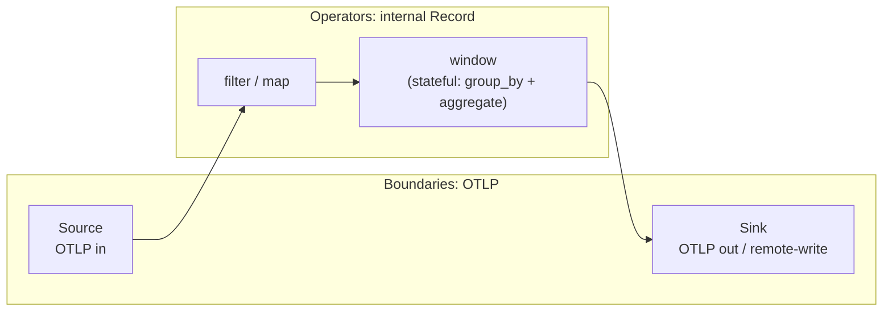
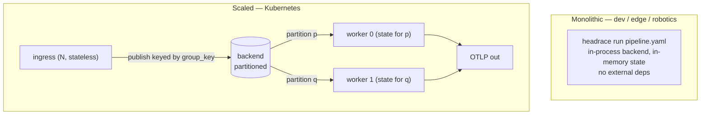
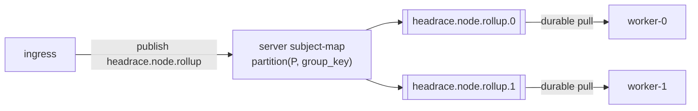
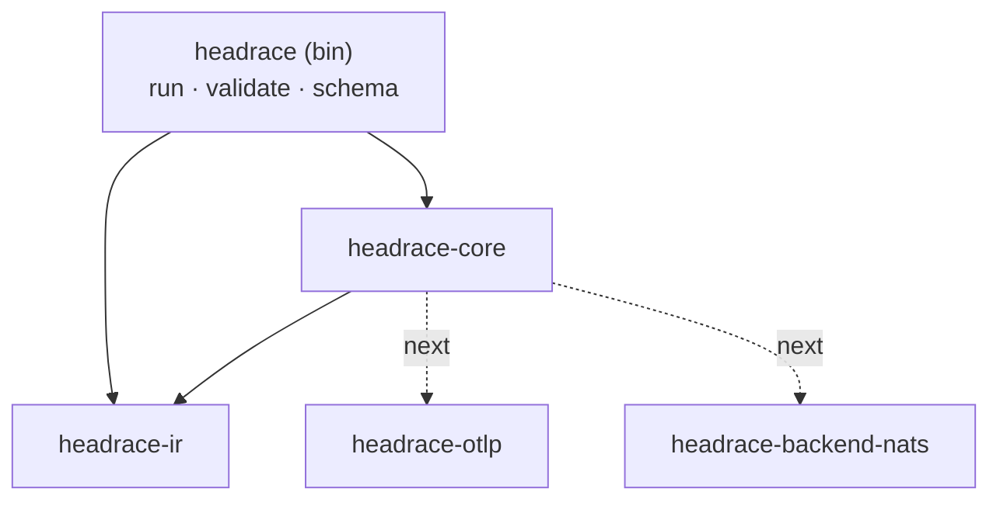

# Headrace — Design

OTel-native, stateful stream processing. Point telemetry at it, define aggregations
declaratively, emit to any backend. Single binary; runs in-process for dev/edge or
scaled on Kubernetes over a partitioned backend.

**Principles**

- Not infrastructure, a layer. No broker, no storage engine, no bespoke controller — rent those.
- OTLP at the edges; a fixed operator catalog in the middle; WASM as the only escape hatch.
- One binary, deployment topology chosen at startup.

## Two schemas, kept separate

| | What it is | Shape |
|---|---|---|
| **Data model** | The records in flight | OTel / OTLP (`Record` = flattened OTel data model) |
| **IR** | The program that processes them | Headrace's own operator-DAG spec (`headrace-ir`), OTel-*aware* but not OTLP |

OTLP is decoded to an internal `Record` at ingest and re-encoded at egress. The columnar
fast path (OTel-Arrow / OTAP) is an internal optimization behind that boundary — invisible
to users. The IR is a separate config language (think Vector topology / Flink job graph);
it is what an authoring agent will target in v0.2.

## Dataflow



Stateless operators (`filter`, `map`) hold nothing. State lives only in windowing
operators, keyed by `group_by` — which is what makes horizontal scaling tractable.

## Run modes

Same binary, role chosen at startup. Mirrors Loki/Alloy monolithic → scalable.



## Scaling & the backend — no controller

Stateful scaling = partition the keyspace so every record for a `group_key` reaches the
same worker; its window state stays local. We do **not** build the machinery for that:

- **Partition assignment + shuffle** → the backend.
- **Pod lifecycle** → Kubernetes (Deployment / StatefulSet).
- **Autoscaling** → KEDA on backend lag.

The `Backend` trait is the seam (`crates/headrace-core/src/backend.rs`): `producer(id) ->
Box<dyn Producer>` / `consumer(id) -> Box<dyn Consumer>`, where `Producer::send(key, rec)`
carries the partition key as bytes. In-process today (mpsc, key ignored); a subject-per-node
JetStream impl (hash `key` into the subject) drops in behind the same trait.

**Backend choice: NATS JetStream** (preferred — embeddable, familiar), with Redpanda/Kafka
as the fallback only if elastic rebalance becomes a hard requirement.

JetStream partitioning is achievable but not automatic like Kafka consumer groups:



- Server-side `partition(P, ...)` subject transform hashes the group key into `…​.{0..P-1}`.
- One durable pull consumer per partition; a worker binds the partitions for its
  StatefulSet ordinal (static assignment: `partition % replicas == ordinal`).
- Trade-off vs Kafka: scaling P is a rolling operation, not seamless elastic rebalance.
  Acceptable for v0.2; revisit if it bites.

**State durability (v0.1–0.2): none.** On worker loss, in-flight windows are dropped and
rebuilt from the next events (at-most-once for in-flight aggregates). Checkpointing window
state to a compacted changelog / PVC is v0.3, at which point workers become a StatefulSet.
Exactly-once is out of scope — that's Flink's fight.

## Stateful semantics

What the windowing operators keep, and how it stays correct under scale and failure.

**Keyed on.** State is keyed by `(operator_id, group_key, window)`, where `group_key` is the
`group_by` tuple. That same key is the shuffle partition key (`Backend::Key` bytes), so a
group's records — and therefore its state — always land on one worker.

**Time is event time.** Windows are placed by the record's own `ts_nanos` (OTel
`TimeUnixNano`), not wall clock. v0.1 triggers flushes on processing time (simple; wrong under
lag/replay). v0.3 moves to **watermarks**: `watermark = max_event_time − allowed_lateness`; a
window `[start, end)` emits when the watermark passes `end`; records later than that but within
the lateness bound update the emitted window, beyond it they drop (or route to a side output).

**Metric temporality is a first-class ingest concern** — this is what makes it telemetry, not
generic streams. OTel metrics are delta *or* cumulative; aggregation must normalize to **delta**
on ingest (or track per-series cumulative baselines and handle counter resets), or windowed
sums are wrong.

**State representation is hybrid — don't force one format:**

- *Data plane* (records in flight, transport): **columnar** (Arrow / OTAP) for vectorized
  decode+filter and the network fast path.
- *Aggregation state* (the accumulators): **row/struct per key** — `{count,sum,min,max}` is
  tiny and point-mutated; columnar buys nothing.
- *Quantiles* (p99 latency): **mergeable sketches** (DDSketch / t-digest), never raw retention.

Every aggregate is a **monoid** (partial ⊕ partial = total). That property is what makes
cross-partition rollups and changelog recovery correct — and it's guarded by a proptest
(`crates/headrace-core/tests/aggregate_props.rs`).

**Persistence has two distinct roles**, both satisfiable by JetStream:

1. *Shuffle transport* — the partitioned subject/stream between ingress and workers.
2. *State changelog* — every mutation also appended to a **compacted** stream keyed by the
   state key; on crash/rebalance the new partition owner replays it to rebuild state before
   resuming (Kafka-Streams model). When keyed state outgrows RAM, back it with **RocksDB**
   (spill to disk). Durability timeline is in *Scaling & the backend* above.

## IR

Declarative, closed over a fixed catalog. Nodes wire by `input` id reference; every output
has one consumer (fan-out is a later `tee`). Full JSON Schema: `headrace schema`.

| Node | Kind | Notes |
|---|---|---|
| source | `generator` | synthetic metrics (dev/test) |
| source | `stdin` | one JSON `Record` per line |
| source | `otlp` | *next* — OTLP/gRPC receiver |
| operator | `filter` | keep where `key` exists / equals |
| operator | `window` | tumbling; `group_by` + `aggregate {count,sum,min,max,avg}`; `on_missing {skip,error}` for absent fields |
| operator | `map`, `wasm` | *next* |
| sink | `stdout` | text / json |
| sink | `otlp` | *next* — OTLP out / Prometheus remote-write |

```yaml
sources:  [{ type: generator, id: gen, interval: 200ms }]
operators:
  - { type: filter, id: only_checkout, input: gen, key: service.name, equals: checkout }
  - type: window
    id: rollup
    input: only_checkout
    size: 5s
    group_by: [service.name, http.route]
    aggregate: { op: avg, field: value }
sinks:    [{ type: stdout, id: out, input: rollup, format: text }]
```

## Pipeline lifecycle & control plane

Where a pipeline definition lives, and how you create/update one — without building a REST API.

- **Now (v0.1–0.2):** the IR is a **file** (`headrace run f.yaml`) or a **ConfigMap** on k8s.
  GitOps (Argo/Flux) is the create/update path.
- **v0.3:** a **`Pipeline` CRD whose `spec` is the IR verbatim**; `status` reports observed state
  (running, per-node lag, assigned partitions, errors). A **thin operator** reconciles `Pipeline`
  CRs → Deployments + backend subjects. The CRD's OpenAPI v3 validation schema is **generated
  from the IR JSON Schema** (`headrace schema`), so `kubectl apply` validates for free and you inherit
  RBAC, GitOps, and admission webhooks.
- **Authoring API:** the v0.2 **MCP server** is how an agent creates a dataflow — emit IR →
  validate against the schema → dry-run → write it as a file or CR. No bespoke REST surface.

This control-plane operator (CR → Deployment) is distinct from, and does not contradict, the
*no data-plane controller* stance above: partition assignment stays the backend's job; the
operator only manages pipeline lifecycle. Runtime aggregation state never lives in the CR —
that's the changelog/PVC (see *Stateful semantics*).

## Internal record model

`crates/headrace-core/src/record.rs` — the OTel data model, flattened to what operators touch:

```
Record { ts_nanos, start_ts_nanos: Option, resource: Attrs, scope, name, value: f64, attrs: Attrs }
Attrs   = map<string, AttrValue{ bool | int | double | str }>   # OTel AnyValue subset
```

Window rollups set `start_ts_nanos`/`ts_nanos` to the window `[start, end)` (OTel
`StartTimeUnixNano`/`TimeUnixNano`); point samples leave `start_ts_nanos` unset.

v0.1 is metrics-shaped (`value: f64`). Logs/traces widen `value` to an enum; the attribute
model is already OTel-compatible.

## Self-telemetry

headrace records its own metrics through a `Metrics` seam (`headrace-core::metrics`) — default
no-op, so the core carries no OpenTelemetry dependency. The `headrace` binary supplies an
OTel-backed recorder (`--metrics stdout|otlp`, off by default) exporting `headrace.records.out`,
`headrace.records.dropped`, `headrace.window.flushes` / `.groups`, and `headrace.node.errors`, attributed
by node id + kind. The instruments are the one piece of state shared across node tasks —
handed out as cheap `Arc` clones — so an OTel tool dogfoods OTLP for its own observability.

## Crate layout



- `headrace-ir` — IR types + JSON Schema. No runtime deps.
- `headrace-core` — record model, `Backend` trait + in-process impl, operators, runtime, `Metrics` seam.
- `headrace` — CLI + OTel metrics exporter (the only crate that depends on OpenTelemetry).

## Roadmap

- **v0.1 (now)** — IR + static validation (refs, cycles, durations), in-process backend,
  generator/stdin → filter/window → stdout. Task supervision (fail fast on node error/panic),
  graceful drain on SIGINT/SIGTERM (second signal forces), OTel self-metrics. Runs.
- **v0.2** — OTLP source/sink, WASM operator, NATS JetStream backend, Helm chart, MCP server
  for agentic authoring against the IR schema, docs site (mermaid-rendering — Vocs or mdBook)
  on Cloudflare Pages, and branding/logo.
- **v0.3** — state checkpointing, event-time windows + watermarks, `map`/`join`, `Pipeline` CRD.
