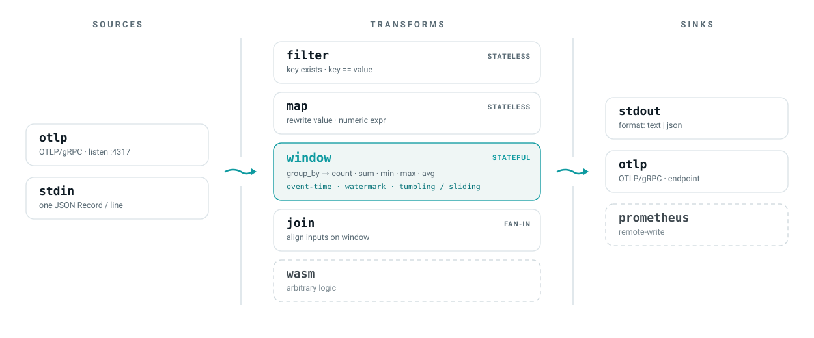

<p align="center">
  
</p>

# Headrace

[](https://github.com/headrace-rs/headrace/actions/workflows/ci.yml)
[](https://codecov.io/gh/headrace-rs/headrace)
[](./LICENSE)

OTel-native, stateful stream processing in a single Rust binary. Point telemetry at it,
define aggregations declaratively, emit to any backend. Runs in-process for dev/edge or
scales on Kubernetes over a partitioned backend.

<picture>
  <source media="(prefers-color-scheme: dark)" srcset="./docs/assets/pipeline-dark.svg">
  
</picture>

See [DESIGN.md](./DESIGN.md).

## Try it

```sh
cargo run -p headrace -- run examples/latency.yaml   # generator -> filter -> 5s window -> stdout
cargo run -p headrace -- validate examples/latency.yaml
cargo run -p headrace -- schema                       # IR JSON Schema
cargo run -p headrace -- --metrics otlp run examples/latency.yaml   # export headrace's own metrics
```

## Features

| Kind | Supported | Planned |
|---|---|---|
| Sources | `otlp` (gRPC receiver), `generator`, `stdin` | - |
| Transforms | `filter`, `window` (tumbling + sliding, event-time), `map` (numeric expressions) | session windows, `join`, `wasm` |
| Sinks | `otlp` (gRPC exporter), `stdout` (text / json) | Prometheus remote-write |
| Aggregates | `count`, `sum`, `min`, `max`, `avg` | quantiles (mergeable sketches) |
| Backend | in-process (single binary) | NATS JetStream (partitioned, scaled) |
| Deploy | Helm chart, OTLP `Record` cumulative-to-delta normalization | `Pipeline` CRD + operator |

Windows are event-time with watermarks, `allowed_lateness`, and `idle_timeout` - see
[docs/windowing.md](./docs/windowing.md). The `map` transform's numeric expression
language is documented in [docs/map.md](./docs/map.md).

## Self-metrics

Headrace exports its own telemetry over OTLP - the same protocol it processes. Off by
default; enable with `--metrics otlp` (or `stdout` for debugging). Attributed by node
`id` and `kind`.

| Metric | Type | Meaning |
|---|---|---|
| `headrace.records.out` | counter | records a node emitted or forwarded |
| `headrace.records.dropped` | counter | records dropped (filtered, or missing aggregate field) |
| `headrace.records.late` | counter | records dropped as too late (their window had already fired) |
| `headrace.window.flushes` | counter | window flush events |
| `headrace.window.groups` | histogram | aggregate groups emitted per flush |
| `headrace.node.errors` | counter | node tasks that terminated with an error |

## Status

v0.1 shipped the in-process pipeline: IR with static validation, `filter` and tumbling
`window`, `generator`/`stdin` sources, `stdout` sinks, and OTel self-metrics. v0.2 has
since added the OTLP source/sink (behind the `otlp` feature), event-time windows with
watermarks and `allowed_lateness`, and a Helm chart.

Roadmap (details in [DESIGN.md](./DESIGN.md#roadmap)) - core processing first, on the
in-process backend and deployable in a real cluster, before a distributed backend:

- **v0.2 - deployable core**: OTLP in/out ✓, Helm chart + GHCR ✓, event-time windows +
  watermarks ✓, sliding windows.
- **v0.3 - richer transforms**: `map`, `join`, local state inspection.
- **v0.4 - scale & extend**: NATS JetStream backend, WASM transform, docs site.
- **v0.5+**: state checkpointing + interactive queries, MCP authoring server, `Pipeline`
  CRD + operator, session windows.

Apache-2.0.
