# Windowing

The `window` transform groups records by `group_by` and reduces each group over a time
window. Windows are placed in **event time** - each record's own `ts_nanos` (OTel
`TimeUnixNano`), not the wall clock - so rollups stay correct under lag, batching, and
replay.

## Watermark

A window `[start, end)` **fires** (emits one record per group, then drops its state) when
the watermark reaches its `end`:

```
watermark = max_event_time_seen - allowed_lateness
```

The watermark is the point in event time up to which input is treated as complete. It
trails the newest event seen by `allowed_lateness`, so a larger grace fires later.

## Tumbling windows

Fixed-size, non-overlapping, aligned to the epoch; every record lands in exactly one
window. With `size: 5s`:

```mermaid
gantt
  title Tumbling windows (size 5s)
  dateFormat X
  axisFormat %Ss
  todayMarker off
  section rollup
  [0,5)   :0, 5s
  [5,10)  :5, 5s
  [10,15) :10, 5s
```



A record at `t=2` reduces into `[0,5)`, one at `t=7` into `[5,10)`, and so on. A record at
`t=5` opens `[5,10)` and advances `max_event_time` to 5; the watermark then reaches the end
of `[0,5)`, which fires `avg` over the records it collected.

## Sliding windows (planned)

Overlapping windows of `size`, advanced by a smaller `slide`, so one record can land in
several. With `size: 10s`, `slide: 5s`:

```mermaid
gantt
  title Sliding windows (size 10s, slide 5s)
  dateFormat X
  axisFormat %Ss
  todayMarker off
  section rollup
  [0,10)  :0, 10s
  [5,15)  :5, 10s
  [10,20) :10, 10s
```



Where the bars overlap, a record falls in every window it spans - one at `t=7` reduces into
both `[0,10)` and `[5,15)`. Not yet implemented - see the [roadmap](../DESIGN.md#roadmap).

## allowed_lateness

Real sources deliver out of order. `allowed_lateness` holds a window open past its `end`
(in event time) so late-but-not-too-late records still count. With `size: 5s` and
`allowed_lateness: 2s`, window `[0,5)` fires only once `max_event_time >= 7`:

```
arrival (in event time):  t=1   t=3   t=6   t=4   t=8
  t=1, t=3  -> fold into [0,5)
  t=6       -> opens [5,10); watermark = 6-2 = 4, so [0,5) stays open
  t=4       -> late, but [0,5) is still open within the grace -> folded in
  t=8       -> watermark = 8-2 = 6 >= 5, so [0,5) fires: avg(1,3,4)
```

A record whose window has already fired is **dropped** and counted on
`headrace.records.late`. A nonzero late rate means `allowed_lateness` is too small for the
source's out-of-orderness.

## idle_timeout

The watermark only advances when records arrive, so a stream that goes quiet leaves its
last windows open. Set `idle_timeout` to force every open window to flush after that much
wall-clock silence. Off by default (windowing stays purely event-time); a clean shutdown
still flushes open windows regardless.

## Configuration

```yaml
transforms:
  - type: window
    id: rollup
    input: in
    size: 5s               # tumbling window length (required)
    allowed_lateness: 2s   # event-time grace before firing (optional, default 0s)
    idle_timeout: 30s      # flush open windows after this quiet (optional, default off)
    group_by: [service.name, http.route]
    aggregate:
      op: avg              # count | sum | min | max | avg
      field: value         # numeric attribute to reduce (default: the record's value)
      on_missing: skip     # skip | error, when `field` is absent or non-numeric
```
